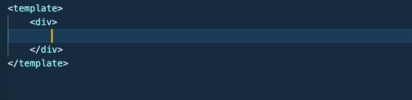

# Vue Css Modules

Extension for quick HTML markup creation in Vue for CSS modules.



## Features

To generate markup, enter a class name prefixed with $container and press Tab.

```
$container
```

...will be transformed into:

```html
<div :class="$style.container"></div>
```

Although CSS Modules recommend using camelCase for class names, you can use any class name and still get a valid transformation.

```
$list__item
```

...will be transformed into:

```html
<div :class="$style['list__item']"></div>
```

## Release Notes

### 1.0.0

Initial release
